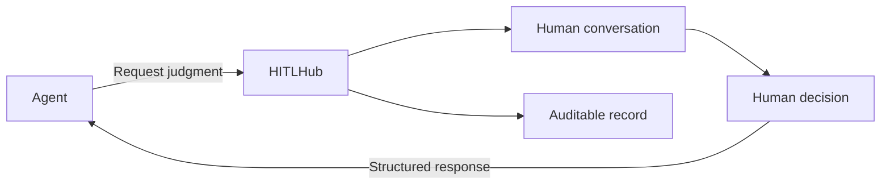

  

  <strong>Open infrastructure for human judgment in agent workflows.</strong>

---

AI agents can move work forward, gather evidence, and propose actions. But some decisions require human context, authority, and accountability.

HITLHub is an open-source project for making those moments a reliable part of agent infrastructure.

An agent opens a session, provides the relevant context, and asks a human for judgment. The human can discuss the situation, request more information, and make the final decision. HITLHub delivers that decision back to the agent and preserves the record.

## Our principles

- 👤 **Humans make the decision.** HITLHub creates the path to human judgment; it does not replace it.
- 💬 **Conversation comes before action.** People can ask questions, review evidence, and add context.
- 🎯 **The right person matters.** Agents reach a permitted user, team, owner, or organizational role.
- ⏳ **Waiting has clear boundaries.** If time expires, the record shows that no human decision was made.
- 🧾 **Decisions remain understandable.** The request, conversation, participants, justification, and outcome are preserved.
- 🔌 **The protocol should be open.** Different agents and frameworks can use the same human-interaction layer.

HITLHub does not monitor an agent's model, reasoning, or runtime. It owns the communication contract between an agent and a human.

---

  <strong>Agents move work forward. Humans retain judgment where it matters.</strong>

